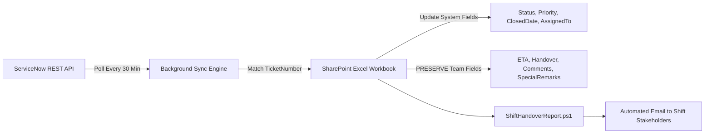

# Shift Handover Report Automation - User Guide & Technical Reference

## 1. Overview
The **Shift Handover Report Automation** script (`ShiftHandoverReport.ps1`) is a completely self-contained PowerShell solution located in `CyberArkAutomation/`. It automates the generation and dispatch of executive-grade shift transition emails from a centralized SharePoint Excel workbook where application teams (e.g. **SailPoint**, **Idera**, **Ping**) track operational tickets, workloads, and shift handoffs.

### Key Capabilities
- **Zero External Script Dependencies**: All logging, Microsoft Graph API authentication, SharePoint downloading, Excel parsing, metric calculation, HTML email generation, and SMTP dispatch logic are self-contained in `ShiftHandoverReport/Modules/`.
- **Multi-Application Tracking**: Aggregates records across separate worksheet tabs owned by each application team (`SailPoint`, `Idira`, `Ping`, etc.).
- **Automatic Shift Detection via Config**: Automatically detects the active shift (**1st Shift** ~11:30 AM or **2nd Shift** ~7:30 PM / 19:30) purely based on the execution time against `config.json`. No shift details are stored in Excel or passed as script arguments.
- **Offline & Testing Support**: Supports `-LocalExcelPath` to run against local `.xlsx` files without connecting to SharePoint, and `-SkipEmail` to generate HTML reports without sending emails.
- **Phase 2 ServiceNow Ready**: Establishes standard schema columns and clear delineation between system metadata and operational handover fields (`ETA`, `Handover`, `Comments`, `SpecialRemarks`).

---

## 2. Directory Structure & File Manifest

```
CyberArkAutomation/ShiftHandoverReport/
├── ShiftHandoverReport.ps1             # Main entrypoint orchestrator
├── config.json                         # Master configuration (SharePoint, Shifts, Email, Mappings)
├── ShiftHandover_Tracker.xlsx          # Excel tracker workbook for SharePoint (SailPoint, Idira, Ping)
├── ShiftHandoverReport_UserGuide.md    # Operational documentation & ServiceNow sync roadmap
├── Modules/
│   ├── SHR_Logging.ps1                 # Logging and retention cleanup module
│   ├── SHR_SharePoint.ps1              # Microsoft Graph API & SharePoint downloader module
│   ├── SHR_DataProcessor.ps1           # Excel parsing, categorization, and metrics engine
│   └── SHR_Email.ps1                   # HTML email rendering and SMTP dispatch module
└── Templates/
    └── ShiftHandoverReport.html        # Responsive executive HTML email template
```

| File / Folder | Purpose |
| :--- | :--- |
| **`ShiftHandoverReport.ps1`** | Clean entrypoint script that imports the local modules and orchestrates the shift reporting lifecycle. |
| **`config.json`** | Central configuration maintaining all parameters without hardcoding. |
| **`ShiftHandover_Tracker.xlsx`** | Standardized Excel tracking hub with separate sheets per application (`SailPoint`, `Idira`, `Ping`). |
| **`Modules/`** | Self-contained subroutines (`SHR_Logging.ps1`, `SHR_SharePoint.ps1`, `SHR_DataProcessor.ps1`, `SHR_Email.ps1`). |
| **`Templates/`** | Email templates (`ShiftHandoverReport.html`). |
| **`ShiftHandoverReport_UserGuide.md`** | Operational guide & ServiceNow sync documentation. |

---

## 3. Centralized SharePoint Workbook Structure

The Excel tracker workbook (`ShiftHandover_Tracker.xlsx`) contains **one worksheet per application team**:
- `SailPoint`
- `Idira`
- `Ping`

Each team maintains only its own tab. All ticket types (Incidents, Service Requests, Changes) live in the same sheet.

> [!IMPORTANT]
> **No Shift Details in Excel**: The Excel workbook contains **NO shift column**. Teams only manage operational ticket details and set the `HandedOver` flag (`Yes`/`No`) when handing over to the incoming shift. The script dynamically determines whether the execution is for **1st Shift** or **2nd Shift** strictly from the system clock and `config.json`.

### Column Specification

| Column Header | Data Type | Required? | Maintained By | Purpose & Guidelines |
| :--- | :--- | :--- | :--- | :--- |
| **`TicketNumber`** | Text | **Yes** | Team (Phase 1) / ServiceNow (Phase 2) | Ticket identifier. Prefix determines type: `INC*`, `RITM*`, `SCTASK*`, `CTASK*`, `CHG*`. |
| **`TicketType`** | Text | Optional | Team / ServiceNow | `Incident`, `Service Request`, `Change`. |
| **`Priority`** | Text | Optional | Team / ServiceNow | `P0` (Blocker), `P1` (Critical), `P2` (High), `P3` (Medium), `P4` (Low). Dropdown validated. Used for Incidents only. |
| **`Status`** | Text | **Yes** | Team / ServiceNow | Operational status: `Open`, `In Progress`, `Pending`, `Resolved`, `Closed`, `Scheduled`, `Implemented`. Dropdown validated. |
| **`OpenDate`** | Date / Text | Optional | Team / ServiceNow | Date ticket was created/opened (`yyyy-MM-dd` or `MM/dd/yyyy`). |
| **`ClosedDate`** | Date / Text | Conditional | Team / ServiceNow | Date ticket was resolved/closed. **Used to calculate Closed Today counts**. |
| **`ShortDescription`** | Text | Optional | Team / ServiceNow | Brief description or ticket title. |
| **`AssignmentGroup`** | Text | Optional | Team / ServiceNow | Operational assignment group or team name. |
| **`AssignedTo`** | Text | Optional | Team / ServiceNow | Name of the primary engineer working the ticket. |
| **`ETA`** | Date / Text | Conditional | **Team (Operational)** | Expected completion date entered by user (`yyyy-MM-dd`). Formatted cleanly as a pure date. |
| **`HandedOver`** | Text | **Yes** | **Team (Operational)** | Set to **`Yes`** or **`No`** (dropdown). Rendered in tables as a color-coded status badge. |
| **`HandoverNotes`**| Text | Optional | **Team (Operational)** | Detailed handover notes and context captured in Excel for engineer reference (**strictly hidden from email**). |
| **`Comments`** | Text | Conditional | **Team (Operational)** | Context: what was done, what is blocked, next steps. |
| **`SpecialRemarks`** | Text | Optional | **Team (Operational)** | Management callouts, vendor ticket references, escalations, or business impact. |
| **`Source`** | Text | Optional | Team | Set to `"Manual"` in Phase 1 (reserved for `"ServiceNow"` in Phase 2). |
| **`LastSyncDateTime`**| Text / Date | Optional | System | Reserved for Phase 2 automated background sync health. |

---

## 4. Reporting & Metric Rules

### Ticket Categorization
- **Incidents**: `TicketNumber` starts with `INC` (or `TicketType` contains `Incident`). Renders full detail table.
- **Service Requests**: `TicketNumber` starts with `RITM`, `SCTASK`, or `CTASK` (or `TicketType` contains `Request`). Renders **count and summary chip only** (no table) to keep email lightweight and executive-friendly.
- **Changes**: `TicketNumber` starts with `CHG` (or `TicketType` contains `Change`). Renders summary chip and active change details table.

### Priority Highlighting Rules (P0, P1, P2)
- Priority (`P0`, `P1`, `P2`, `P3`, `P4`) applies to **Incidents** and is left blank for Service Requests and Changes.
- If an Incident has priority **`P0`**, **`P1`**, or **`P2`**, its table row is automatically highlighted with a subtle corporate tint (`#fff1f2`) and a distinct priority badge (`pri-crit`) to immediately draw attention without overwhelming visual noise.
- If Priority is blank, it cleanly renders as `—`.
- All other incidents (`P3`, `P4`) and changes render with clean, neutral styling.

### ETA Date Format
- ETA is kept as a pure date (e.g. `2026-09-18`), as operational engineers input the target date. The engine normalizes timestamps down to the date component.

### Handed Over Column
- In the email report, each incident and change row displays a dedicated **Handed Over** column:
  - **`Yes`**: Highlighted in a crisp dark slate badge (`hnd-yes`).
  - **`No`**: Displayed in subtle muted text (`hnd-no`).
- Handover notes from Excel (`HandoverNotes`) are kept strictly within Excel and **not** printed in the email to keep the report clean and executive-friendly.

### Workload Metric Rules
- **Open Workload (Active Work)**:
  - Any ticket whose `Status` is **NOT** `Closed`, `Resolved`, `Completed`, `Cancelled`, or `Implemented`.
  - Sub-categorized into:
    - **In Progress (`WIP`)**: `Status` contains `In Progress`, `Work in Progress`, `WIP`, or `Active`.
    - **Pending**: `Status` contains `Pending`, `On Hold`, `Awaiting Info`, `Awaiting Vendor`, `Awaiting User`.
    - **Open**: Any remaining active status (`Open`, `New`, `Assigned`).
- **Closed Today**:
  - `ClosedDate` matches the reporting date (`yyyy-MM-dd`). Tickets are counted only on the day they were completed.
- **Implemented Changes**:
  - `CHG` tickets marked `Implemented` or `Closed` on the report date.
- **Handover Items**:
  - Any ticket where `Handover -ieq "Yes"` (or `"Y"`). These are compiled directly into the prominent **Tickets Handed Over to Next Shift** table with priority badges, owner, ETA, and handover comments.

---

## 5. Execution & Command-Line Usage

### Standard Production Run (Automatic Shift Detection)
```powershell
# Run without parameters:
# - Triggered around 11:30 AM -> Automatically evaluates to "1st Shift"
# - Triggered around 07:30 PM -> Automatically evaluates to "2nd Shift"
# - No shift parameters needed or accepted
.\ShiftHandoverReport.ps1
```

### Historical or Retroactive Run
```powershell
# Run report for a specific date (shift is still determined by execution time window)
.\ShiftHandoverReport.ps1 -ReportDate "2026-09-16"
```

### Local Testing / Offline Verification (No SharePoint, No Email)
```powershell
# Test locally against an offline Excel file and skip email dispatch
.\ShiftHandoverReport.ps1 -LocalExcelPath ".\ShiftHandover_Tracker.xlsx" -SkipEmail
```

### Recipient Override
```powershell
# Send test report to a specific engineer
.\ShiftHandoverReport.ps1 -LocalExcelPath ".\ShiftHandover_Tracker.xlsx" -SendEmailTo "admin@company.com"
```

---

## 6. Configuration Reference (`config.json`)

```json
{
  "ApplicationSheets": [ "SailPoint", "Idera", "Ping" ],
  "ExcelSource": {
    "Mode": "SharePoint",
    "_Comment_Mode": "Options: 'SharePoint' or 'Local'. If 'Local', reads directly from LocalPath. If 'SharePoint', downloads from SharePoint.",
    "LocalPath": "ShiftHandover_Tracker.xlsx"
  },
  "SharePoint": {
    "Enabled": true,
    "TenantId": "<Azure-AD-Tenant-ID>",
    "ClientId": "<Azure-AD-App-Client-ID>",
    "ClientSecret": "",
    "CCP": {
      "Url": "https://ccp.company.com/AIMWebService/api/Accounts",
      "AppId": "CyberArkHealthCheck",
      "Safe": "PAM-Health",
      "Object": "SharePointAppSecret"
    },
    "SiteUrl": "https://company.sharepoint.com/sites/Operations",
    "DocumentLibrary": "Project Documents",
    "FolderPath": "Operations/ShiftHandover",
    "FileName": "ShiftHandover_Tracker.xlsx"
  },
  "Shifts": {
    "_Comment_Shifts": "2 operational shifts: 1st Shift (scheduled ~11:30 AM) and 2nd Shift (scheduled ~7:30 PM / 19:30).",
    "Windows": [
      { "Name": "1st Shift", "ScheduledTime": "11:30", "Start": "03:30", "End": "15:30" },
      { "Name": "2nd Shift", "ScheduledTime": "19:30", "Start": "15:30", "End": "03:30" }
    ]
  },
  "Email": {
    "Enabled": true,
    "SmtpServer": "smtp.company.com",
    "From": "cyberark-operations@company.com",
    "To": [ "operations-team@company.com" ],
    "Cc": [],
    "SubjectTemplate": "Shift Handover - {ReportDateFormatted} {ShiftName}",
    "AttachWorkbook": false
  }
}
```

> [!TIP]
> **Authentication Option**: If `ClientSecret` in config is left empty, the script automatically queries CyberArk Central Credential Provider (CCP) using the `SharePoint.CCP` block to securely fetch the secret at runtime.

---

## 7. Windows Task Scheduler Setup (2 Shifts)

To dispatch the handover report automatically at each shift transition, schedule 2 tasks in Windows Task Scheduler (no shift parameters needed; the job automatically identifies the shift from the execution time):

1. **1st Shift Handover** (Trigger: Daily at **11:30 AM**)
   - Program: `powershell.exe`
   - Arguments: `-ExecutionPolicy Bypass -File "C:\Scripts\CyberArkAutomation\ShiftHandoverReport\ShiftHandoverReport.ps1"`
2. **2nd Shift Handover** (Trigger: Daily at **07:30 PM**)
   - Program: `powershell.exe`
   - Arguments: `-ExecutionPolicy Bypass -File "C:\Scripts\CyberArkAutomation\ShiftHandoverReport\ShiftHandoverReport.ps1"`

---

## 8. Phase 2: Automated ServiceNow Synchronization Roadmap

The Phase 1 architecture is engineered specifically to enable non-disruptive ServiceNow synchronization in Phase 2:



### Key Principles for Phase 2:
1. **Strict Field Partitioning**:
   - **System Managed Fields**: `TicketNumber`, `TicketType`, `Priority`, `Status`, `OpenDate`, `ClosedDate`, `ShortDescription`, `AssignmentGroup`, `AssignedTo`. (Updated automatically from ServiceNow).
   - **User Managed Operational Fields**: `ETA`, `Handover`, `Comments`, `SpecialRemarks`. (Strictly preserved during sync reconciliation).
2. **Deduplication**: Match records on `TicketNumber`. If an engineer logs a manual row before the 30-minute sync cycle, the engine merges the ServiceNow record into the existing row rather than appending a duplicate.
3. **Auditability**: The `Source` column switches to `"ServiceNow"` and `LastSyncDateTime` records the timestamp of the last successful sync.
